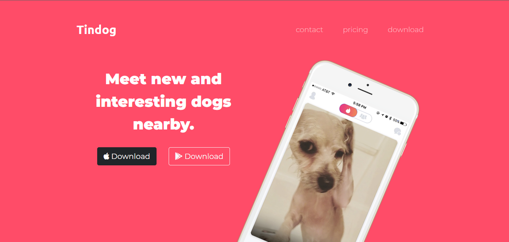

# TinDog

### This is a website made for dogs to find their soulmates. This is basically Tinder for dogs.

<h3 align="left"style="display:inline-block; font-size:2rem;">Languages and Tools used in this project:</h3>

   

<h3 align="left">Connect with me:</h3>

<a herf="https://github.com/AnshuSarkarANX/tindog.git"><h3 align="left" style="font-size:1.5rem;">Clone this project</h3></a>
